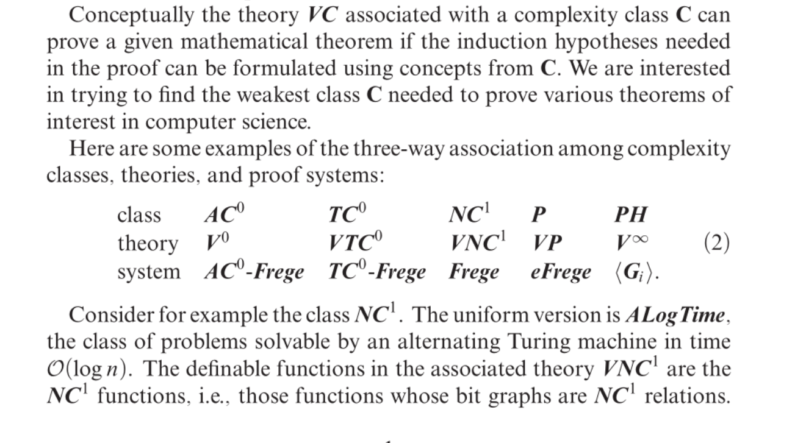
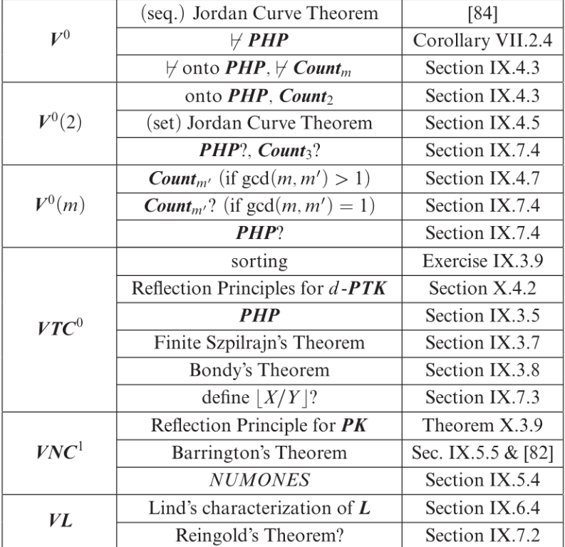

---
title:
- Czym ja się aktualnie zajmuję?
author:
- Paweł Balawender
date:
- 9 maja 2025r.
# pandoc -t beamer dziembowski.md -o dziembowski.pdf --bibliography references.bib --citeproc  -M link-citations=true -V colortheme:crane -V theme:CambridgeUS --csl apa.csl
---
# Motivation
>- Chcę rozwijać dziedzinę weryfikacji formalnej
>- Eksperymentuję z gotowymi narzędziami: Coq, Lean, Isabelle, Dafny
>- Zastanawiam się jak te narzędzia ulepszyć
>- Rozważam do jakich celów potrzebowalibyśmy nowych narzędzi - i jak je zaprojektować
>- Nie chcę poświęcać całego życia na naukę teorii typów. Chcę działać blisko logiki i teorii złożoności

# Języki dla klas złożoności
>- To jest moja magisterka
>- Nie mamy porządnego narzędzia do zapisywania programów z klasy LOGSPACE. Nie mamy też porządnego narzędzia dla obwodów AC^i, NC^i, uniform AC etc.
>- Dead end: praca Neergaarda (język programowania dla L), prace Ugo Dal Lago i Ulricha Schoppa (system typów dla L, NL)
>- obiecujące (praca Cooka): język programowania dla FAC0 (AC0-redukcje) + problem L-zupełny / NL-zupełny etc.

# Praktyczne implementacje problemów zupełnych
>- SAT Solving competition (CTU Prague)
>- Mój projekt:
    * redukcja Hamiltona do 'itauto', bo IIPL = PSPACE;
    * redukcja Hamiltona do BCK jest możliwa, a BCK = NP. To daje nam szybką taktykę do rozwiązywania celi dowodowych wyrażalnych logiką BCK
    * implementacja BCK w Isabelle pomyślna
>- Solvery dla problemów PSPACE-zupełnych też mają sens dla bardzo małych instancji. Przecież SAT też jest infeasible. Przykładem jest 'tauto' z Coqa
>- Być może jest sens zrobić solvery dla innych NP-problemów (gdy redukcja do SAT ma quadratic blowup), lub nawet dla P-problemów (super-szybki solver dla Circuit Value, albo Horn-SAT, 2SAT?)

# Problem: Coq, Lean etc. są zbyt silne!
>- Te narzędzia są skomplikowane. Ciężko się ich nauczyć. Bywają błędy w implementacji (DeepSeek prover to wykorzystał paskudnie!).
>- Większość dowodów wymaga prostych teorii! To jest program Reverse mathematics, który bada jakie aksjomaty są wymagane by udowodnić dane twierdzenie

# Reverse math
>- Base theory: RCA0 = aksjomaty arytmetyki Robinsona, indukcja dla Sigma^0_1 formuł, comprehension dla Delta^0_1 formuł
>- RCA0 wykazuje Intermediate Value Theorem for continuous real functions
>- WKL0: RCA0 + Słaby Lemat Koniga jako aksjomat (nieskonczone drzewo binarne ma nieskonczona galaz)
>- WKL0 wykazuje, że funkcja ciągła na [0,1] jest Riemann-całkowalna
>- twierdzenie Bolzano-Weierstrassa jest wyżej; jest równoważne ACA0
>- Niżej niż RCA0 jest np. $I\Delta_0$

# Bounded arithmetics
>- Reverse mathematics, mimo że ma z założenia badać najsłabsze systemy matematyczne, już rozumuje całkiem wysoko. Sigma^0_1 = recursively enumerable sets.
>- Żeby zejść niżej, musimy wejść w teorie opracowaną przez m.in. Bussa i Cooka, ale też będącą kiedyś głównym zainteresowaniem Leszka Kołodziejczyka - bounded arithmetic

# Niesamowita praca Cooka i Nguyena
>- https://www.karlin.mff.cuni.cz/~krajicek/cook-nguyen.pdf
>- Leszek Kołodziejczyk się też tym zajmował i ma pracę z Nguyenem!
>- Cook podaje logiki odpowiadające FAC0, FAC^i, FNC^i, FL, FP

# 

#
>- Pigeonhole principle, n+1 gołębi, n pudełek, można wyrazić formułą w V0 (czyli VAC0), ale nie można udowodnić! Bo funkcji PHP nie wyrazimy w AC0. Ale wyrazimy ją w TC0, bo tam można zliczać. PHP jest twierdzeniem VTC0
>- Cook rozważa też $I\Delta_0$ i pokazuje że $I\Delta_0$ = Linear Time Hierarchy

#
>- 

# Co chciałbym robić? 1. Formalizacja Reverse Mathematics 
>- Dzięki pracy Cooka moglibyśmy sprawić że matematycy będą myśleć o złożoności obliczeniowej swoich twierdzeń
>- Zjednoczenie ludzi od reverse mathematics z ludźmi od złożoności obliczeniowej
>- Spopularyzowanie na Wydziale narzędzi do weryfikacji formalnej poprzez pokazanie logikom z Wydziału że można wygodnie formalizować ich twierdzenia, i wykrywać w nich błędy / niejednoznaczności w definicjach!
>- Wszystkie definicje w jednym miejscu, a często niełatwo je znaleźć, bo to niszowa dziedzina!
>- Już to zacząłem robić i to jest naprawdę obiecujące! W Leanie można sprawnie sformalizować hierarchię formuł
>- W Isabelle sformalizowałem aksjomaty 2-BASIC i udowodniłem proste twierdzenie. Ciężej jest natomiast sformalizować hierarchię formuł; Isabelle naprawdę kiepsko działa i ma martwe community

# Co chciałbym robić? 2.a) Taktyki dla słabych logik
- Upraktycznić twierdzenia z Logiki postaci "problem sprawdzenia czy formuła w logice L jest tautologią, jest PSPACE-zupełny / NP-zupełny" (np. IIPL = PSPACE) poprzez umożliwienie rozumowania w dokładnie L w Coq i dopisania taktyki, która dla danego celu z L odpala program o złożoności PSPACE / NP, który generuje dowód formuły (lub zawodzi)
- To nie wymaga języka programowania dla NL. Obejdzie się bez niego, choć byłby fajny.
- W zależności od rozważanej logiki Logic, to ograniczenie logiki provera do Logic może być łatwiejsze lub trudniejsze do zaimplementowania w np. Coq lub Isabelle.
- W tym kierunku pierwszym fajnym krokiem był mój projekt Hamilton -> itauto
- Nikogo tu nie znam. Współpraca z community Coqa / Leana i może Damianem Niwińskim

# Co chciałbym robić? 3. Praktyczna Złożoność Obliczeniowa {.allowframebreaks}
- Formalna weryfikacja twierdzeń postaci "dodawanie dwóch liczb binarnych jest w LOGSPACE"
- Dead end: używanie maszyn Turinga w Coq to jest koszmar (mail of Yannicka Forstera)
- To wymaga języka programowania dla rozważanej klasy złożoności C, np. dla LOGSPACE, który do tego wspiera pewną weryfikację. Takim językiem jest Dafny!
- W tym kierunku już zrobiłem częściową formalizację wyniku "Dodawanie jest w L" poprzez napisanie imperatywnego programu wyrażającego maszynę z L i większość dowodu poprawności. Mam też zweryfikowaną w Dafny implementację Topological Sort, który rozwiązuje P-zupełny Circuit Value Problem
- To byśmy prawie na pewno chcieli robić w Dafny, ewentualnie Why3, żeby zapisać algorytmy i dowody, a dopiero potem zrobić forka Dafny ograniczającego siłę wyrazu Dafny do prostych maszyn turinga i przepisać nasze dowody / programy do tej drugiej, ograniczonej wersji Dafny

# Co chciałbym robić? 4. Porządna biblioteka testów jako benchmark solverów {.allowframebreaks}
- Po prostu stworzyć dużą, porządną bibliotekę testów do najważniejszych problemów z teorii
>- Hamilton
>- dodawanie liczb binarnych w two's complement
>- Circuit Value problem: tutaj jako test-casy, obwody np. wyrażające AC0-redukcje! bardzo ciężko jest je wygrzebać z literatury!!
>- One-way permutations in NC0: [@10.1016/0020-01908790053-6]
>- Improved Pseudorandom Generators for AC0
Circuits [@lyu2023improvedpseudorandomgeneratorsmathsfac0]
>- Sokoban!
- Do tego super narzędzie wizualizacji np. rysowanie grafu, wyświetlanie planszy Sokoban etc.
- Autorzy oddający formalnie zweryfikowany program implementujący np. rozwiązywanie Sokobana poprzez PSPACE-zupełny solver (tauto), mogliby odpalić nasze testy na nim i mieć ładne wizualizacje. 
- To mogłaby być podstawa do naszego MIM-owego odpowiednia SAT solving competition! Może współpraca z Pragą!

# Co chciałbym robić? 5. Porządne solvery
- Po prostu szybkie solvery dla SAT (to łatwe - odpalamy istniejący), co-SAT? QBNF? 
- jeśli problem jest w NC1, to powinien być implementowaly na GPU? Napisać na GPU super szybki solver dla problemu NC1-zupełnego

# Co chciałbym robić? 6. Uniform NP witness
>- Jest praca: Bellare, Goldreich, Petrank: https://cseweb.ucsd.edu/~mihir/papers/ug.pdf 
>- Moglibyśmy prawdopodobnie przepisać jej wyniki na formuły CNF, rozwiązywać je SAT-solverem i w ten sposób generować rozwiązane Sudoku z rozkładu jednorodnego!
>- Prawdopodobnie moglibyśmy potem z rozwiązanej planszy cofać się deterministycznie
>- tj. usuwać wypełnioną cyferkę
>- przy użyciu tylko podanych zasad inferencji, np. jeśli jedynym rozumowaniem które możemy przeprowadzić jest "jeśli w wierszu 8 cyfr wypełnionych, to 9 też znamy", to tylko na podstawie tej reguły "usuwamy" cyfrę
>- za każdym razem musimy się upewnić że rozwiązanie pozostaje unikatowe

# Co chciałbym robić? 6. Uniform NP witness 
>- i w ten sposób generować "idealne" łamigłówki Sudoku! Czyli nigdy nie wymagające backtrackingu przy rozwiązywaniu
>- Zamiast Sudoku możemy wziąć problem ważniejszy dla Kryptografii

# Co chciałbym robić? 7. Praktyczna Złożoność Opisowa
- Upraktycznić twierdzenia z Descriptive Complexity postaci FO[TC] = NL: praktyczną wartością z tego twierdzenia jest dla nas, że jeśli chcemy zapisywać w Dafny programy imperatywne o złożoności NL, to logiką wyrażającą specyfikację takich programów wystarczy jak będzie FO[TC]!
- Na pewno nie potrzebujemy silniejszej logiki. Natomiast być może warto rozważyć słabszą, np. FO. Wtedy dalej zapiszemy wszystkie NL-programy, tylko nie zweryfikujemy poprawności wszystkich!

# Poniżej tylko appendix

# FO
- FO[+, *] = FO[BIT]
- FO[<, *] = FO[BIT] (Crane Beach Conjecture)
- FO[+] is less expressive than FO[<, *] = FO[<, /] = FO[<, COPRIME] [@10.1002/malq.200310041]

# DLOGTIME
- example of DLOGTIME reduction to show tree isomorphism for string-represented trees, is NC1-complete [@694595]

# NC0
- One-way permutations in NC0: [@10.1016/0020-01908790053-6]
- All sets complete under AC0 reductions are in fact already complete under NC0 reductions: [@10.1145/258533.258671]
- Immerman at page 81 shows how to do addition in NC0 and MAJORITY in NC1 [@Immerman1998-IMMDC]
- Addition and substraction of binary numbers is in AC0: [@27676]
- This is not trivial, as these algorithms in NC0/AC0 use Chinese Remainder Representation or Fermat's Little Theorem!

# AC0
- Addition is in AC0 [@BussLectureNotes]
- FO[+, *] = DLOGTIME-uniform AC0 (https://complexityzoo.net/Complexity_Zoo:A#ac0)
- Discussion of DLOGTIME-uniform AC0: [@hella2023regularrepresentationsuniformtc0]
- Tutaj mamy definicje AC0, TC0, FATC0, FTC0 etc.: [@AGRAWAL2000395]

# TC0
- Multiplication is in TC0 [@BussLectureNotes], this resource cites this: [@doi:10.1137/0213028] but i cant find relevant info there

# NC1
- Division is in DLOGTIME-uniform NC1: [@ITA_2001__35_3_259_0]
- Reductions for NC1: UE* reductions; UE*-uniform NC1 = ALOGTIME [@RUZZO1981365]
- example of many-one NC1 reduction for L-completeness of tree isomorphism (trees repr. as pointers): [@694595]

# L
- Reductions for L: e.g. first-order reductions, Immerman 1999 p.51
- USTCONN is complete for L
- a programming language for L: a finite number of variables, each <= n
- alternative: a finite number of input pointers; this is really similar to multi-head two-way automaton [@423885] [@10.1007/BF00289513]
- a formal proof of composition in L could be of interest for formal verification

# FL
- to show FL-completeness, it suffices to show L-completeness: FL = L* = L + NC1 reductions [@COOK19852, proposition 4.1]
- examples of FL-complete problems: 

# SL
- L subset SL subset NL
- 2004: L = SL

# NL
- STCONN is FO-complete for NL, NL closed under FO reductions (https://en.wikipedia.org/wiki/First-order_reduction)

# What makes a verification problem interesting?
- VerifyThis competition! https://verifythis.github.io/onsite/cfp/ 
- Leino: https://program-proofs.com/

# Horn-satisfiability is P-complete
- https://github.com/mikolalysenko/horn-sat?tab=readme-ov-file
- Prolog should be able to do that?
- https://cs.stackexchange.com/questions/171728/is-the-functional-circuit-value-problem-fp-complete
- Interesting: Implement Horn-SAT or CVP in Dafny!
- Use simple code for calculations and ghost functions to prove correctness!

# Circuit Value Problem
- For a given single-tape, polynomial-time Turing machine `M` and input `x`, in [@Kozen2006], there is an explicit construction of a boolean circuit over (0, 1, `and`, `or`, `not`) (with fan-in 2 for `and`, `or` and 1 for `not`), with one output node, such that its value is 1 if and only if machine `M` accepts input `x`. The construction is in LOGSPACE. So CVP is P-complete w.r.t. LOGSPACE-reductions.
- This is a good example of a LOGSPACE-reduction, being a good benchmark for the LF programming language and for the circuit description language
- The problem is that we can't generate tests for it; we have no database of Turing machines descriptions
- It can be implemented using topological sorting. We have code for toposort in Dafny! [@faria2023casestudiesdevelopmentverified]
- https://github.com/joaopascoalfariafeup/DafnyProjects
- We have some code here also: https://rad.ort.edu.uy/server/api/core/bitstreams/8ed3c93c-feb3-430c-8ee2-a7ec8875fc37/content 
- Toposort in WhyML: https://github.com/Ekdohibs/why3-toposort/blob/master/topo.mlw 

# Concrete Turing Machines
- How to obtain definitions of concrete Turing machines, with transitions stated explicitly etc.?
- Small deterministic Turing machines: [@KUDLEK1996241]
- Small universal Turing machines: [@ROGOZHIN1996215]
- Verified programming of Turing machines in Coq Forster: [@10.1145/3372885.3373816]
- Formalizing Turing machines: [@10.1007/978-3-642-32621-9_1]
- Ciaffaglione's proof of halt in Coq has a Turing Machine code

# FNP class
- https://cs.stackexchange.com/questions/71617/function-problems-and-fp-subseteq-fnp
- https://cstheory.stackexchange.com/questions/37812/what-exactly-are-the-classes-fp-fnp-and-tfnp
- https://complexityzoo.net/Complexity_Zoo:F#fp

# SAT is NP-complete
- a tool can output a short witness for a 'yes' instance
- but a proof for the 'no' instance can be of exponential size!
- verified sat solver in dafny + remarks about sat solvers: https://arxiv.org/pdf/1909.01743 

# Bounded arithmetics
- https://users.math.cas.cz/~jerabek/papers/vnc.pdf

# References {.allowframebreaks}